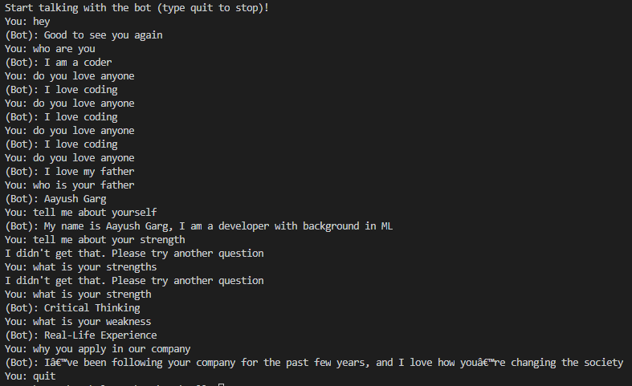

# Chatbot 

## Motivation 
This AI Chatbot is designed to give answers of all basic questions asked in interviews HR round. It helps to practice most common interview questions and their best possible answers. Helpful in building confidence by talking to a bot, that do not get offended to silly answers by you and is always ready to help you when you are alone. Hope you will love it and make best out of it.

## Quick Start
- Clone this repository

      git clone https://github.com/Aayush-hub/AI_Chatbot.git
      
- Change directory

      cd AI_Chatbot

- Install requirements.txt

      pip install requirements.txt
      
- Run python file

      python main.py
      
## Working

      
## If you want to contribute to this project, you are warmly welcomed!! 

                                            
<b> Process </b>

- Fork this repository

- Clone the Repository 

- Add upstream 

      git add upstream https://github.com/Aayush-hub/AI_Chatbot.git
      git remote -v, to check upstream successfully added

- Make new branch for changes  ` git checkout -b branch `

- Add your files or make changes in files

- Add Changes    ` git add .`

- Commit Changes   ` git commit -m "your message here" `

- Push changes     ` git push `

- Make Pull Request

- Wait for your PR to be reviewed

## Project Owner:

Made with :heart:&nbsp;  by

<a href="https://github.com/Aayush-hub"> <b>Aayush Garg</b></a> 

## :star: Citation

 You are allowed to cite any part of the code or our dataset. You can use it in your Research Work or Project. Remember to provide credit to the Maintainer Aayush Garg by mentioning a link to this repository and his GitHub Profile.

Follow this format (see [owner.json](owner.json)):
- Author's name - Aayush Garg
- Date of publication or update in parentheses.
- Title or description of document.
- URL.

